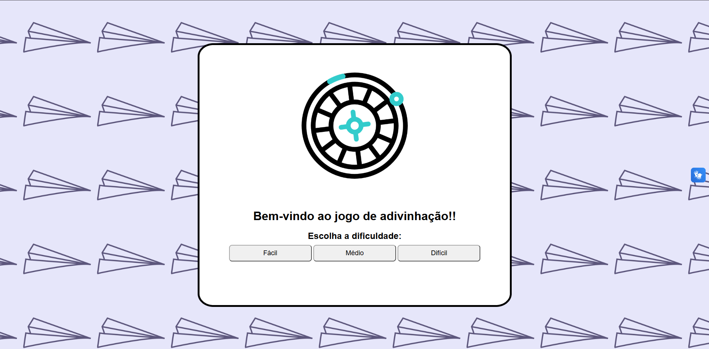

# 🎯 Adivinhe o Número

Um jogo de adivinhação feito para praticar HTML, CSS e JavaScript.

Você escolhe uma dificuldade e tenta descobrir o número sorteado entre 1 e 100. A cada tentativa, o jogo indica se o número correto é maior ou menor que o seu palpite.

## 🎮 Jogue online

**[JOGAR AGORA →](https://theylo01.github.io/jogo_adivinhe_o_numero/)**

## 📌 Dificuldades

- 🟢 **Fácil:** tentativas ilimitadas
- 🟡 **Médio:** 10 tentativas
- 🔴 **Difícil:** 3 tentativas

## 🛠️ Tecnologias

- HTML5
- CSS3
- JavaScript
- SweetAlert2
- VLibras

## 📷 Demonstração

